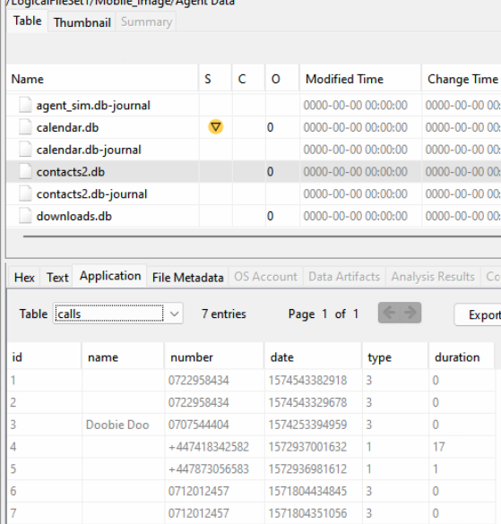

# Report for Autopsy Demo - Mobile devices

Juan Diego Llano Miraval

Fecha: 18/05/2024

## procedure

1. Which device was this image taken from? 

	R. It is a Nexus 5X, I was able to look a the device properties and check the model:

    

2. What is the device’s IMEI number? 

	R. The IMEI is 353626075095047, on the sim DB file we can retrieve the device ID.

    

3. What mobile network does the SIM belong to? 

	R. From the previous image we can also get the operator of the sim: Safaricom.

4. When was this text message received “Nitumie kwa hii namba plz 
(0707701525) itatoa jina Douglas Mugendi.” 

	R. From tge mmssms.db we can check the messages sent. From there we looked for the requested message and got the following date: 1571833969012, in the normal date format it is:  Wednesday, October 23, 2019 2:32:49.012 PM GMT+02:00 DST
    
    

5. What was the number that send the message “Nitumie kwa hii namba plz 
(0707701525) itatoa jina Douglas Mugendi.”? 

	R. From the previous image we can also see that in the table we have the sender address: +254794660124	

6. An international call was received by the device. Which country did the call 
come from? 

	R. On the Contacts db we have a table for calls, inside we can see this number: +447418342582 the +44 code is from United kingdom.

    

7. What is the name of the 7-letter wireless network the device has connected to 
at some point? 

    R. We can see the wifi configuration on the wifi.db, there we find the SSID: kongoni

    

8. What is the mobile device owner’s username on Twitter? 

	R. Digging throw the files, we found an account file where we can retrieve the twitter account name: KamiLenana

    

9. List the google accounts that were linked to this device? 

	R. From the previous image we can retrieve the google accounts too: cocoash100@gmail.com and lenanakami@gmail.com

10. Identify the forensics app installed on the device?

	R. On the sd card we digged into android data, this usually have information of the apps, and we found a folder related to the forensic app: AFLogical OSE: Open source Android Forensics app and framework

    