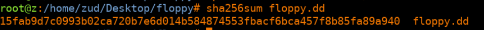
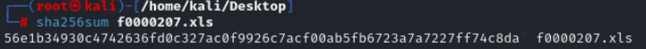

# Reporte de Data carving - Floppy Disk

Juan Diego Llano Miraval

Fecha: 18/05/2024

## Procedure

The first step was checking the sha256:

it is correct to say this is the same as the provided, so we mount the disk into autopsy, and got 3:

I also found another document but it was a copy of the second document in the image. From this we can see 2 documents of text, and 1 microsoft excel file. When we checked the first file:

it is just text that is not relevant to the case, but in the metadata we can confirm that Emma Crook was the creator of the file, so she might be the owner of the floppy disk. The second file is similar as the first one, there is no relevant information related to the investigation:

For the third file, it was encrypted:

we exported the .xls for further analysis. We extracted the sha256 from the excel file before proceeding:

 We confirmed that this is a microsoft excel file and we proceed to open. When we open it requests a password, so it is encrypted:

We took out the hash of the file with the help of john the ripper:

And by running a simple analysis (by accident i was checking the hash was correct) john the ripper got the password from a default password list:

Another strategy I was planning to use, was an incremental brute force attack. We have finally opened the excel file and got: 

This is the evidence requested that Emma Crook was selling information.