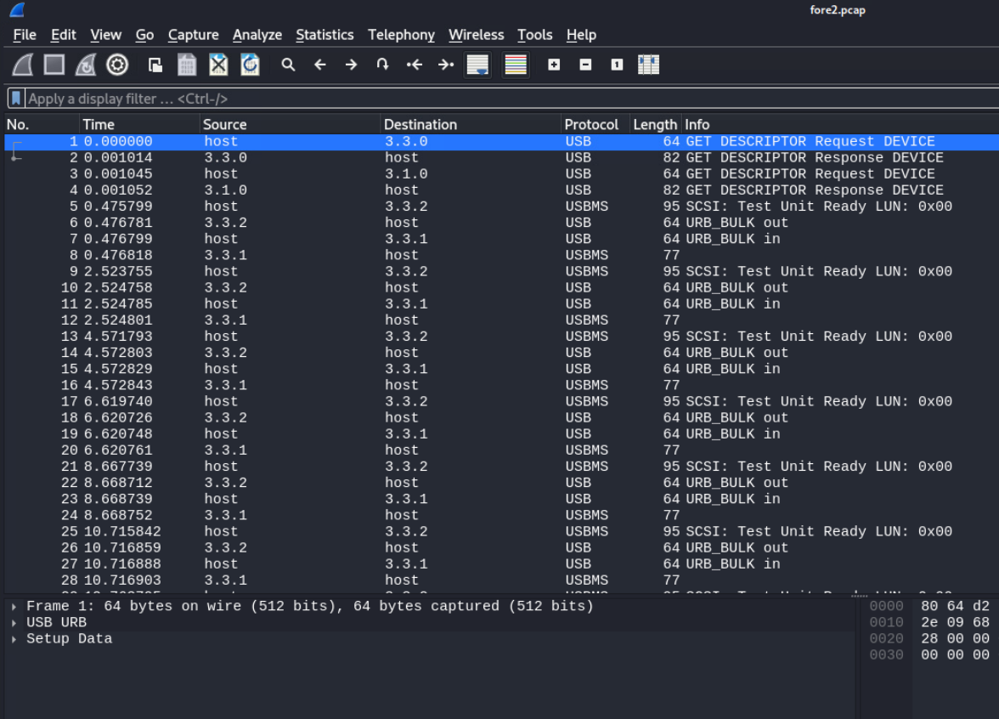
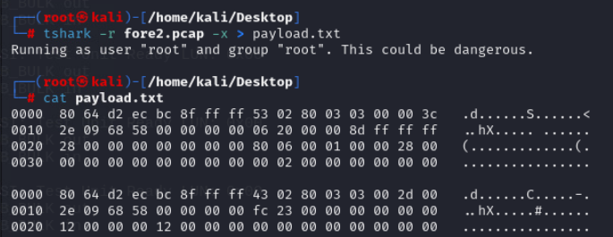
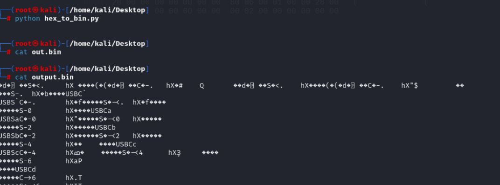
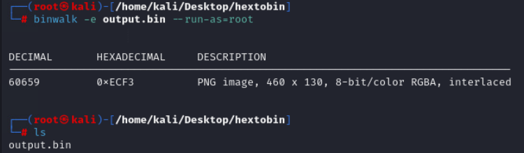
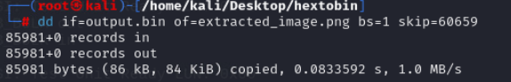
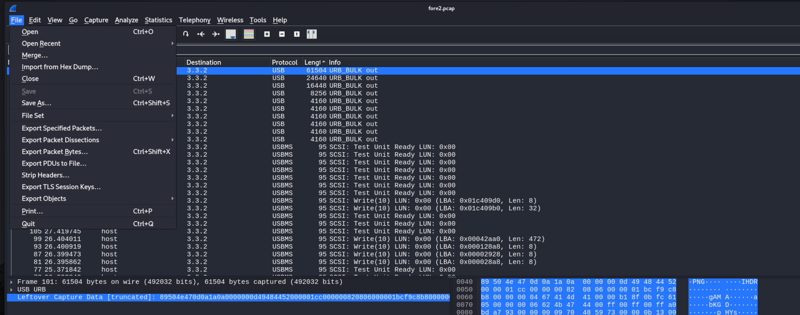

# Reporte de Data carving - Capture the Flag 

Juan Diego Llano Miraval

Fecha: 18/05/2024

## Procedure

The first step on this is to verify the content of the pcap file:



As we were mentioned, there are two ways to find the required data, one of them is by converting the data into binary. The first step for this is to use tshark to convert the data into hex:



We later created a small python code to transform the hex into binary:

```
import re


def hex_to_bin(input_file, output_file):

    with open(input_file, 'r') as f:

        lines = f.readlines()

    

    hex_data = []

    for line in lines:

        # Match hex data lines which are of the form: "0000  00 11 22 33 44 55 66 77 88 99 aa bb cc dd ee ff"

        match = re.search(r'^[0-9a-fA-F]{4}\s+((?:[0-9a-fA-F]{2}\s+)+)', line)

        if match:

            hex_line = match.group(1).replace(' ', '')

            hex_data.append(hex_line)

    

    with open(output_file, 'wb') as f:

        for hex_line in hex_data:

            f.write(bytes.fromhex(hex_line))


hex_to_bin('payload.txt', 'output.bin')


```



We run the code and we get the binary of the pcap. After this we run binwalk with -e to extract any file inside.



Unfortunately, binwalk was not able to extract the file, but we now know that there is a PNG file inside, and we also have the position. With the help of the ```dd``` tool we extracted the file:



We exported the file as a png, and we checked again if the file indeed is a png:


When we open this image we get the flag we were looking for:


for the second method, i opened the file on wireshark and filter trough length. This filter allows me to see the messages that have more information, and it didn't take too much effort to find a packet with a png header on the data. I exported the file from wireshark and i get the image we were looking for:



having selected the data in wireshark, we go to file, export packet bytes, and then we save the file. What we get is the image we were looking for:


The flag is: ALEXCTF{SN1FF_TH3_FL4G_OV3R_USB}

