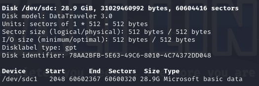
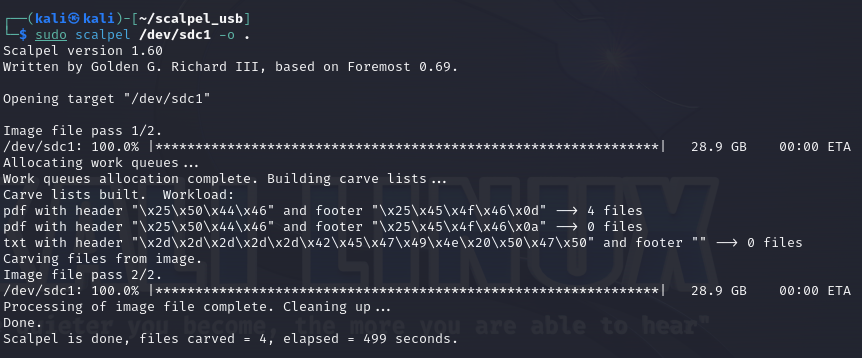
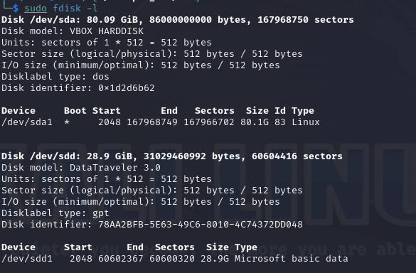
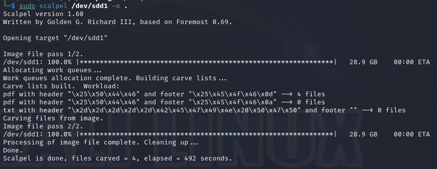
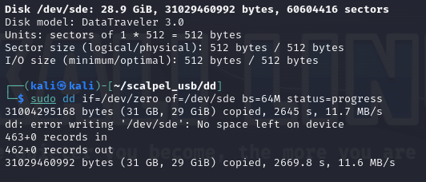
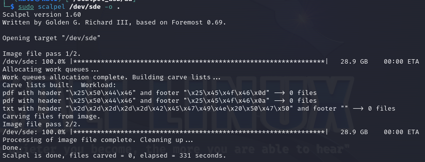

# Reporte de Data carving - USB

Juan Diego Llano Miraval

Fecha: 16/05/2024

## procedure

The first after deleting some files, is connecting the usb into our linux machine and check for the disk:

after this we use Scalpel to check for deleted files into the USB disk.

After this, we return the USB to the windows environment and run a quick format on the USB. Then we plug it into the Linux and check the disk once again:

after this we perform another scan with scalpel:

After this step, we put some PDFs into the USB and run a dd command to clear the information in the USB:

and finally we run a final scalpel:

There were no files inside the drive after the dd format. This is because dd is writing the data of the drive into zeros, and when we usually delete or quick formate a drive, it doesn't errase the data, the space is free, but it contains the information. This is why before we could recover the files.