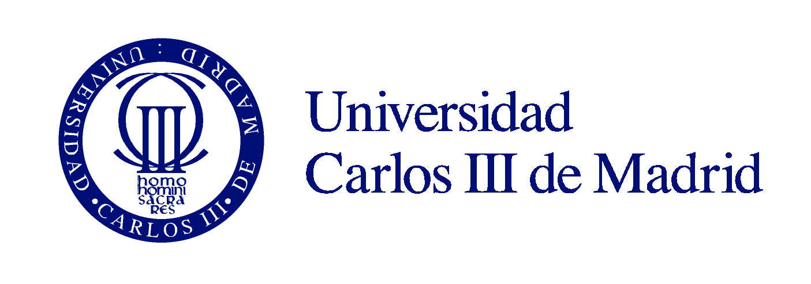

# Report for Email


Juan Diego Llano Miraval

Fecha: 19/05/2024

## procedure

1. What is the recipient’s email?

we can see the Delivered to being; ```Delivered-To: 0xpi81Hp@yWNDuJ.COM``` so the email is sent to 0xpi81Hp@yWNDuJ.COM


2. What is the sender’s email?

The from section tell us ```From: <xpi81Hpy@WNDuJR.COM>``` so the email who sent it was: xpi81Hpy@WNDuJR.COM


3. What is the recipient’s IP address?

We check the the first received (from top to bottom) and check the IP: 162.134.234.209
on ```Received: by 162.134.234.209 with SMTP id c1234trf3719itc;```


4. What is the sender IP address?

We check the the first received (from the bottom to top) and check the IP: 128.8.70.66 This is the server who sent the email.
on ```Received: from red6.ncl.edu (red6.ncl.edu [128.8.70.66])```


5. What is the content type of the message?

the contet type is: text/plain; charset=us-ascii

we can see it on the line ```Content-Type: text/plain; charset=us-ascii``` at the bottom of the email.


6. What day of the week was the message received?

We can check the Date header ```Date: Wed, 09 Sep 2015 14:29:08 -0400``` and we can also keep track of all the dates on the receives to have a timeline. It was on Wednesday.

