# Report for Linux Analysis


Juan Diego Llano Miraval

Fecha: 19/05/2024

## procedure

We validate the sha256:

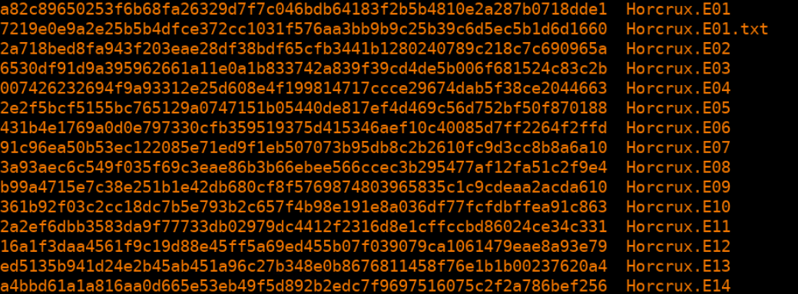

1. What distribution of Linux is being used on this machine?

On the partition 5, on the boot folder we can see some kali files, so we can confirm this is a Kali Linux.

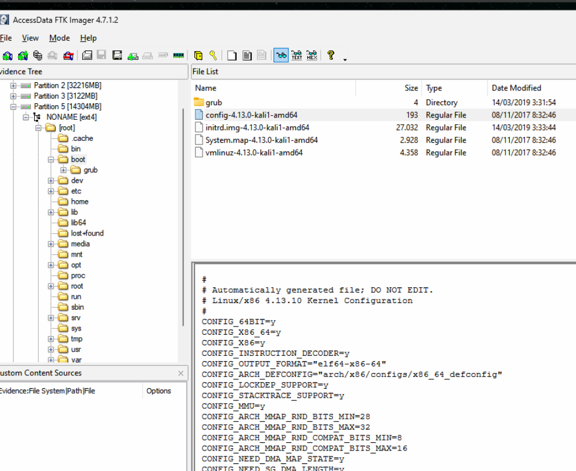

2. What is the MD5 hash of the apache access.log?

By looking at ```/var/log/apache2/access.log``` we cans see the file, we right click and export hash list. The output is:

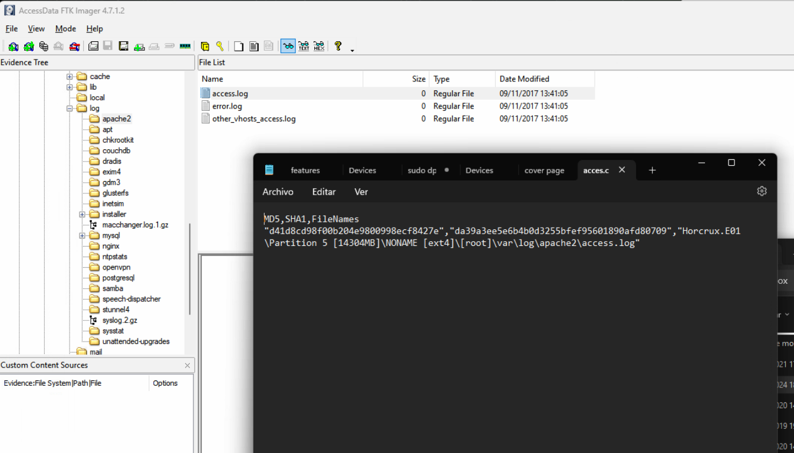

d41d8cd98f00b204e9800998ecf8427e


3. It is believed that a credential dumping tool was downloaded. What is the
file name of the download?

Looking trhough the files leads me to the Download folder where I see ```mimikatz_trunk.zip```

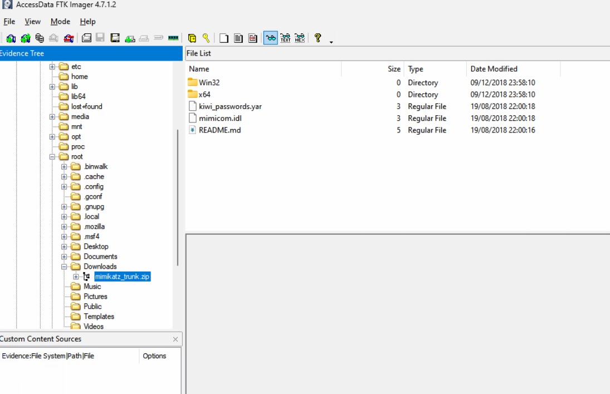

4. There was a super secret file created, what is the absolute path?

On the .bash_history we can trace down the commands and found:

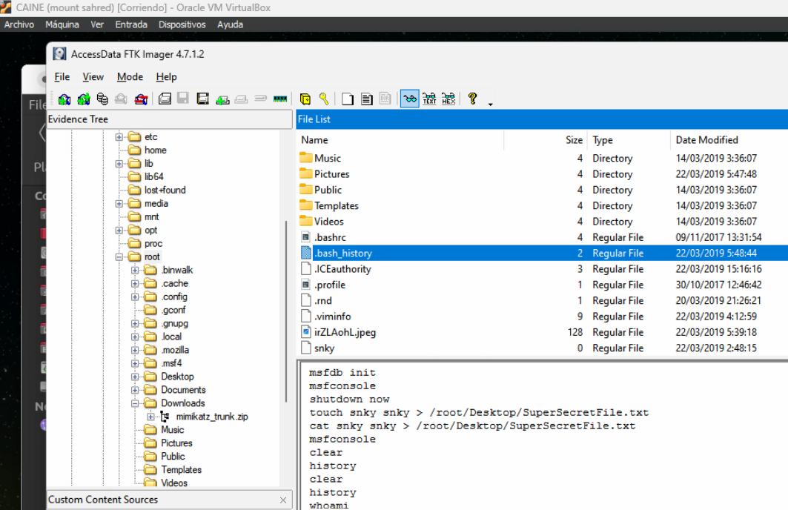

```/root/Desktop/SuperSecretFile.txt``` 


5. What program used “didyouthinkwedmakeiteasy.jpg” during execution?

On the same .bash_history we look for any command using “didyouthinkwedmakeiteasy.jpg” and we found:

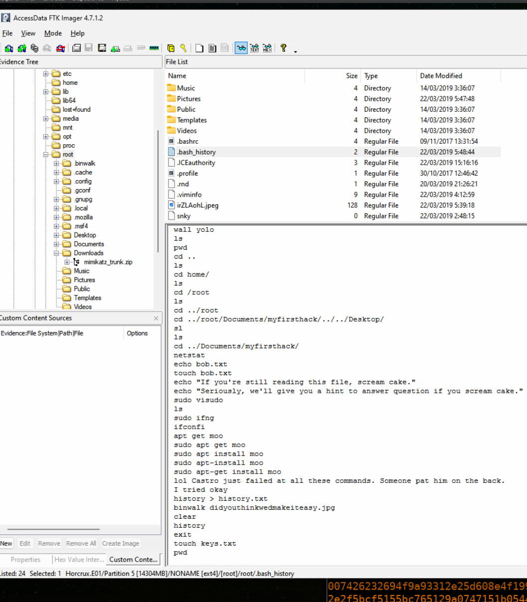

binwalk


6. What is the third goal from the checklist Karen created?


As we saw previously, there was a secret file created on Desktop, so we take a look and found the check list:

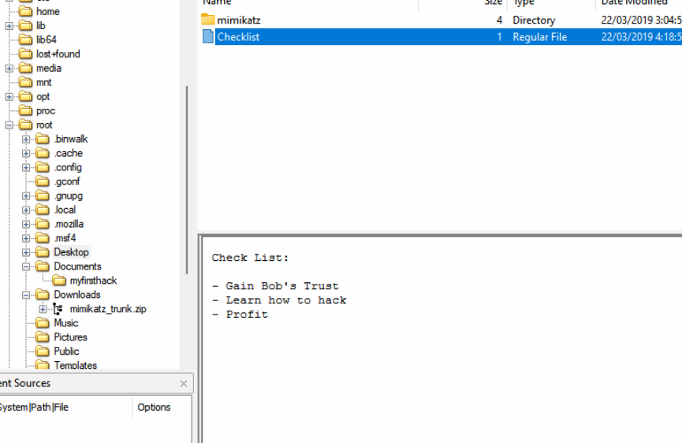

the third goal is profit.


7. How many times was apache run?

When looking at the logs for any time stamp, we realized that the logs have 0 bytes, they were ready to start but the service never started, so the time apache ran was 0.

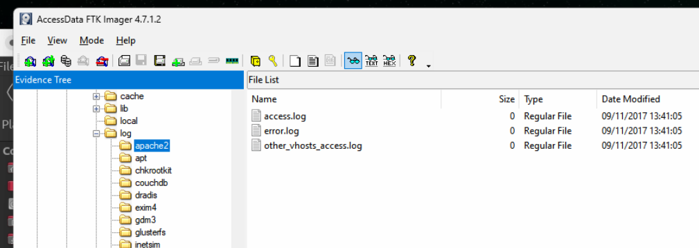


8. It is believed this machine was used to attack another, what file proves
this?”

We know there ia a metsploit framework being used, but on the history we cant find evidence of an attack to someone. By expanding the view, we checked the images, and found:


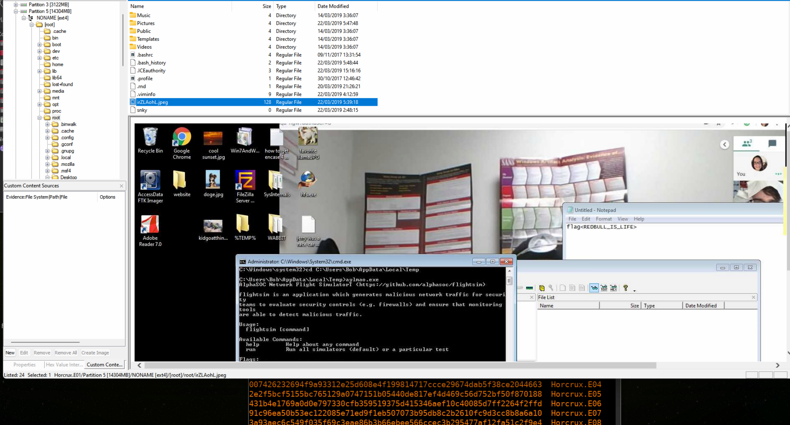

this is a screenshot of a windows machine, but the image is from a Kali Linux, this might be taken from the victim.


9. Within the Documents file path, it is believed that Karen was taunting a
fellow computer expert through a bash script. Who was Karen taunting?

On the firstscript_fixed we can found a message to Young:


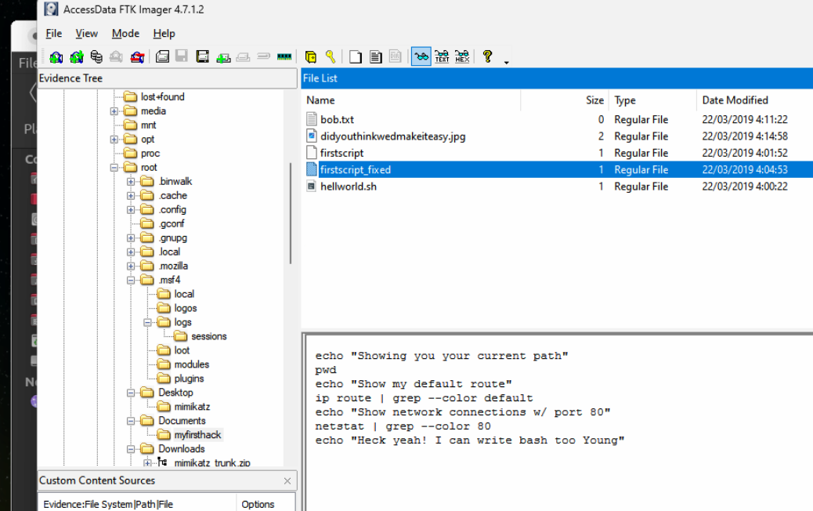

she was tauting Young

10. A user su’d to root at 11:26 multiple times. Who was it?”

By looking at ```/var/log/auth.log``` we can look the requested time and found that it was postgres:


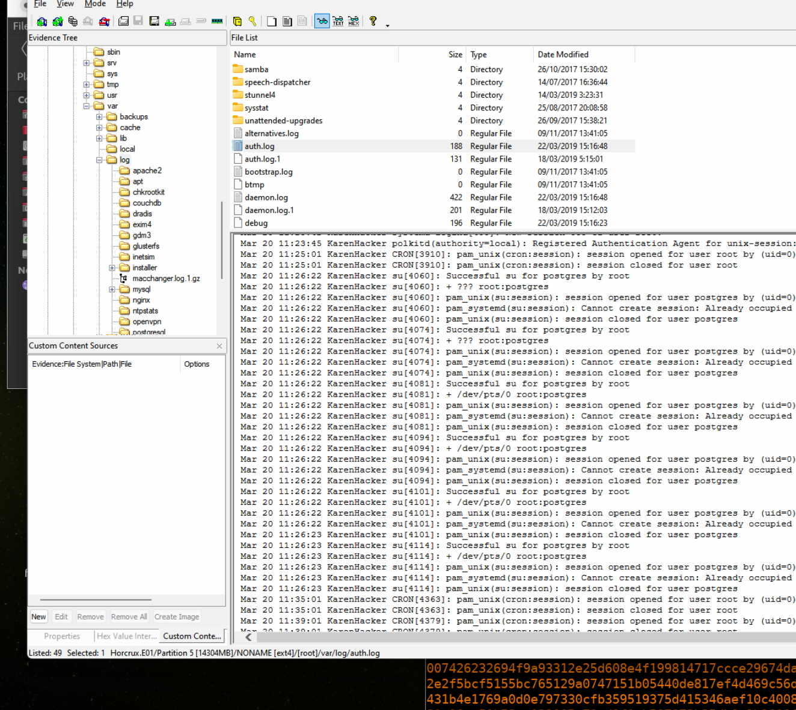


11. “Based on the bash history, what is the current working directory?

the last directory change was to: ```/root/Documents/myfirsthack```

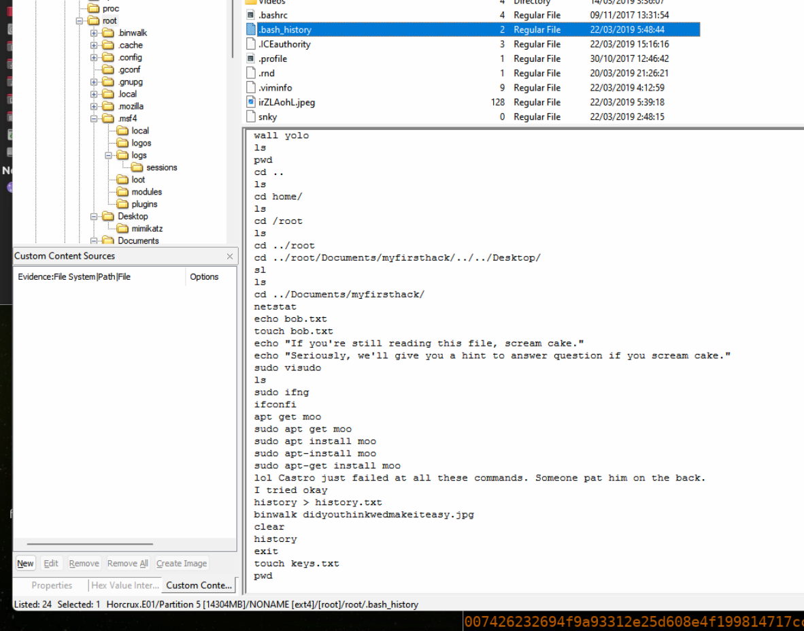