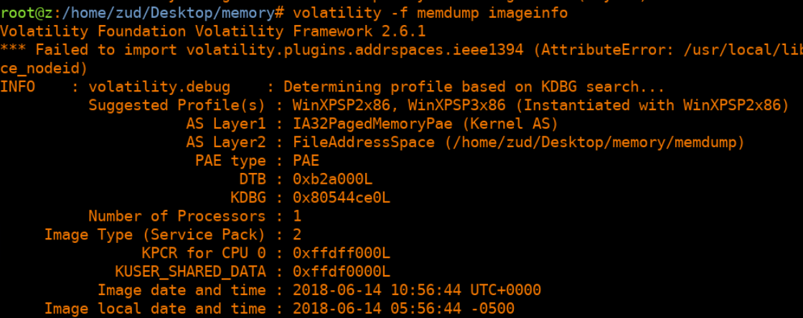
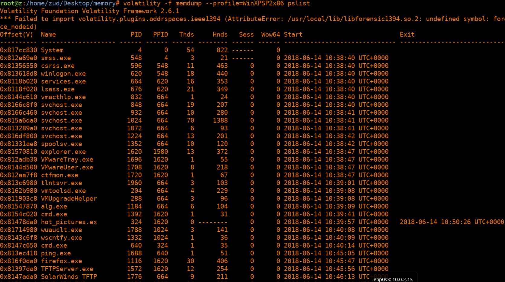
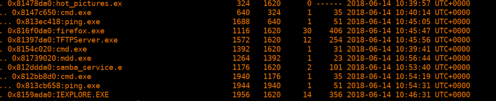
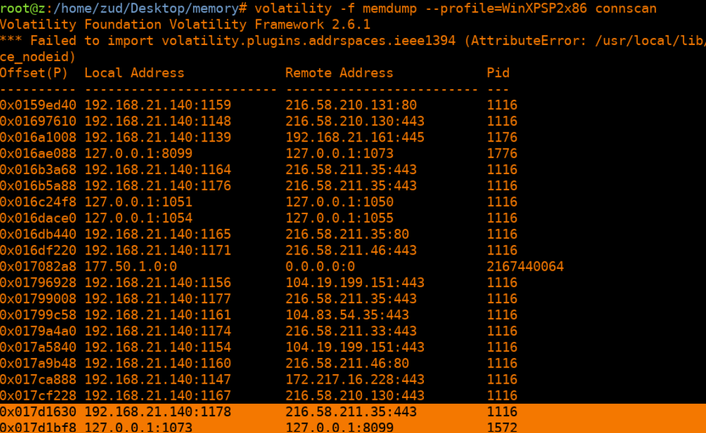

# Report for Memory Analysis (I) - IP Address

Juan Diego Llano Miraval

Fecha: 18/05/2024

## Procedure

The first step on this is to get the profile of the memory:

with this we analice the processes inside the memory:

with pstree on volatility we get some interested processes associated to a potential attack vector:

We proceed to check the connections, most of them are from the firefox process, but there are this ones from the samba service:

we did find suspicious processes that could have infected the system, and an odd connection through the samba process, the IP is [192].[168].[21].[161] at port 445.