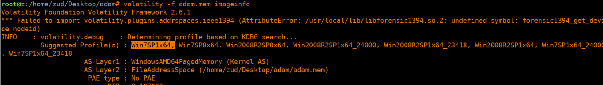
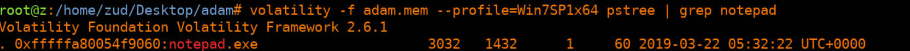
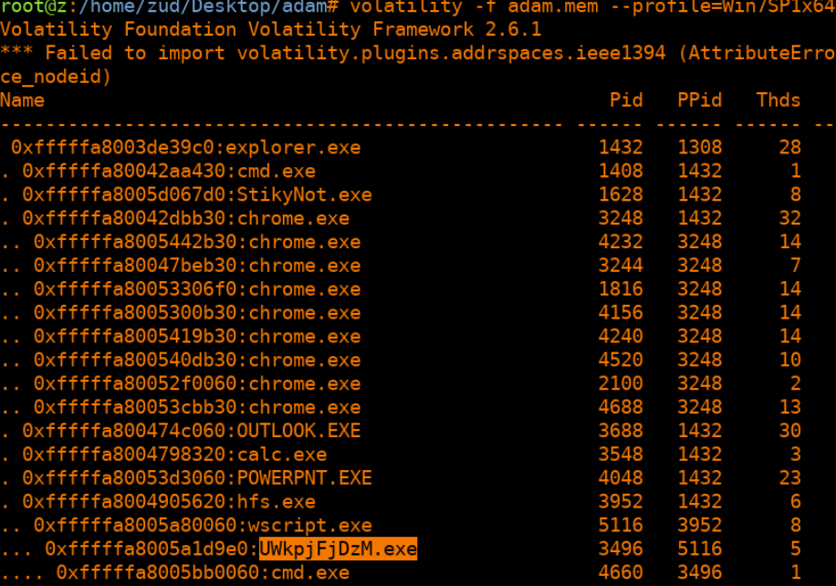
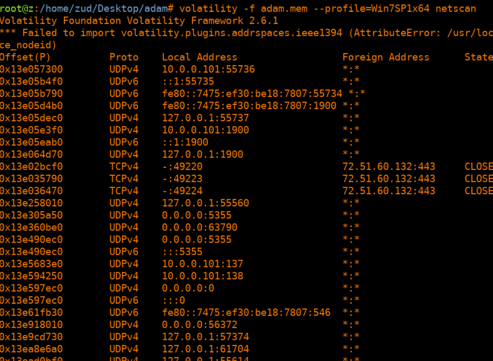
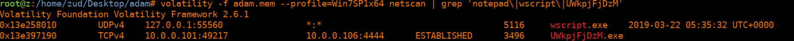
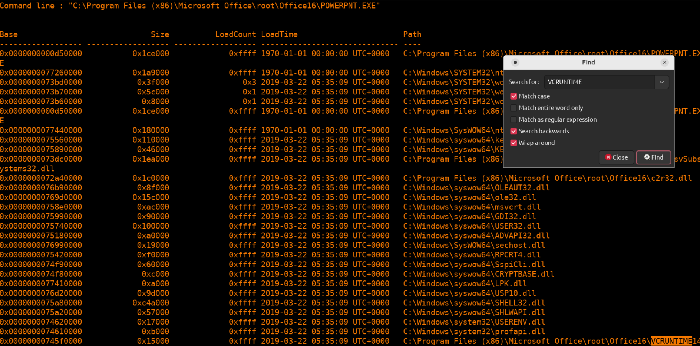
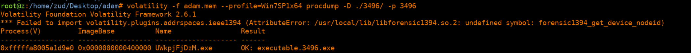
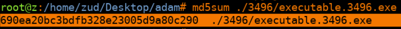
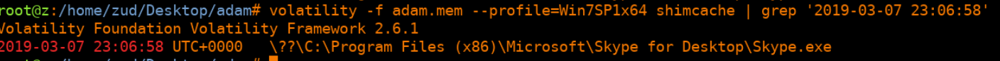
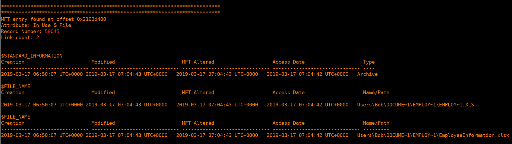

# Report for Memory Analysis - Evidences 

Juan Diego Llano Miraval

Fecha: 18/05/2024

## questions

1. What profile is the most appropriate for this machine? (ex:
Win10x86_14393)

The most appropriate profile is Win7SP1x64

2. What was the process ID of notepad.exe?

The process ID of notepad is: 3032
we executed a pstree on volatility and grep notepad.

3. Name the child processes of wscript.exe.

The child processes of wscript.exe are: UWkpjFjDzM.exe and a child of UWkpjFjDzM.exe is: cmd.exe
we executed a pstree on volatility and grep wscript.

4. What was the IP address of the machine at the time the RAM dump was
created?

With netscan we can visualize the network and the local IP of the machine, besides the ipv6 and local address we get that the IPv4 of the machine is: [10].[0].[0].[101]

5. Based on the answer regarding to the infected PID, can you determine
what the IP of the attacker was?

with a grep on the netscan we checked for notepad, wscript and UWkpjFjDzM (the child of the wscript) and we got 2 connections, and 1 of them containing the IP of the attacker, which is: [10].[0].[0].[106]

6. What process name is VCRUNTIME140.dll associated with?

I ran dllist and check for all the processes with that dll with the search function of the console:
C:\Program Files (x86)\Internet Explorer\iexplore.exe
C:\Program Files (x86)\Microsoft Office\root\Office16\OUTLOOK.EXE
C:\Program Files (x86)\Microsoft Office\root\Office16\EXCEL.EXE
C:\Program Files\Common Files\Microsoft Shared\ClickToRun\OfficeClickToRun.exe
C:\Program Files (x86)\Microsoft Office\root\Office16\POWERPNT.EXE

7. What is the md5 hash value the potential malware on the system?

The PID of UWkpjFjDzM is 3496, and we are sure this PID is malicious, so we extract the process from the memory:

and then we get the md5 hash from it: 690ea20bc3bdfb328e23005d9a80c290  ./3496/executable.3496.exe

8. An application was run at 2019-03-07 23:06:58 UTC, what is the name of
the program? (Include extension)

I ran shimcache that let me know when was the last time an executable was accessed or modified, the program was: Skype.exe

9. What is the shortname of the file at file record 59045?

I use mftparser to check the Master File Table. In here I use the grep tool again to find the 59045 record. There are 2 file names, the short name is: EMPLOY~1.XLS

10. This box was exploited and is running meterpreter. What PID was
infected?

The PID running meterptreter which is PID 3496 a child of wscript with PID 5116.

We are sure of meterpreter running on 3496 as it was the PID who established the connection with the attacker.
