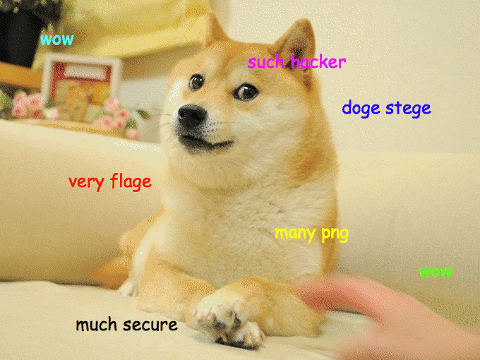
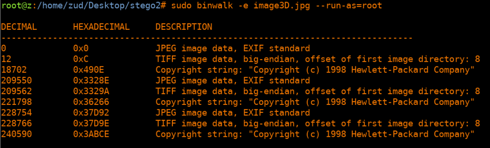

# Report for Stego Exercises

Juan Diego Llano Miraval

Fecha: 19/05/2024

## procedure

1. for the first CTF, we download the image:



Then we get the sha256 to verify it:


With the muted colormap I can start to see some letters:


with the op2 map I can see more clearly the letters:


With a little more of playing with the colors I get:


pctf{keep_doge_alive_2014}

2. We verify the sha of the image:


We run a binwalk to verify any file inside, and indeed we can see another image inside:




I used dd to extract the jpg that I can see thanks to binwalk:


and after checking the images, one of them is:


GCTF{d474_c4rv1n6_15_345y}

3. We download the image:


Then we used a stego tool to follow the hints, it is MSB, only one color channel, and top down means columns. From this and trying every channel I got:


flag{MSB_really_sucks}pizzas

4.  From this one we got an audio file. We will use audacity to analyze it:


we cant take too much information from this so we will keep looking. I checked the integrity of the file and I ran a binwalk on the wav file and I got:


When I analize the files with Deepsound I can see one of the ask me for a password:


by playing a little with the spectrogram with Sonic visualizer I get the following:


Wit the extracted code: BSXPeQrbG3HrG1in2VrU I was able to access the file with Deepsound:


but the flag is not there:


when we check this doc file, we found the following information on the metadata:


GCTF{57364n06r4phy_15n7_7h47_h4rd}


5. Now we are given another image to process:


we will check the integrity of the file first:


we can see now that there is a zip file inside the image, so we will try to retrieve it:


the pass file contains:

```
You're nearly there.
Password: l0v3z1z1
```
I tried using jphs but it didnt work, all the outputs were just data, nothing to be analyzed:


Using a windows version:


That zip file contained a .txt file:


GCTF{z1pp3d_17_r34l_71gh7}