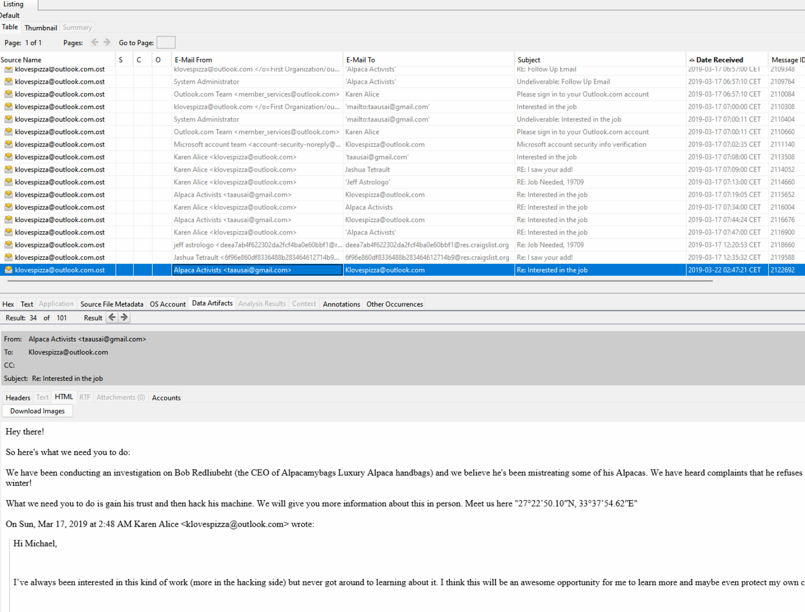

# Report for Windows Analysis


Juan Diego Llano Miraval

Fecha: 19/05/2024

## procedure

We validate the sha256:


### For the adquisition process

1. What is the name of the examiner who created the E01?

we can look inside the txt file and see:

```
Created By AccessData® FTK® Imager 4.1.1.1 

Case Information: 
Acquired using: ADI4.1.1.1
Case Number: 9.75
Evidence Number: 394
Unique description: Lbh'er n jvmneq Uneel!
Examiner: Minerva
Notes: Why does Voldemort only use Twitter and not Facebook? --Because he has followers not friends...

--------------------------------------------------------------

Information for C:\Users\amanda.johnson01\Downloads\Horcrux\Horcrux:

Physical Evidentiary Item (Source) Information:
[Device Info]
 Source Type: Physical
[Drive Geometry]
 Cylinders: 6,527
 Heads: 255
 Sectors per Track: 63
 Bytes per Sector: 512
 Sector Count: 104,857,600
[Physical Drive Information]
 Drive Interface Type: lsilogic
[Image]
 Image Type: VMWare Virtual Disk
 Source data size: 51200 MB
 Sector count:    104857600
[Computed Hashes]
 MD5 checksum:    3422bde521801901155f73f7de5cd8fe
 SHA1 checksum:   0fa6ab4bd9a707d49ded70e8b9198fe18114b369

Image Information:
 Acquisition started:   Fri Mar 22 20:08:08 2019
 Acquisition finished:  Fri Mar 22 20:25:53 2019
 Segment list:
  C:\Users\amanda.johnson01\Downloads\Horcrux\Horcrux.E01
  C:\Users\amanda.johnson01\Downloads\Horcrux\Horcrux.E02
  C:\Users\amanda.johnson01\Downloads\Horcrux\Horcrux.E03
  C:\Users\amanda.johnson01\Downloads\Horcrux\Horcrux.E04
  C:\Users\amanda.johnson01\Downloads\Horcrux\Horcrux.E05
  C:\Users\amanda.johnson01\Downloads\Horcrux\Horcrux.E06
  C:\Users\amanda.johnson01\Downloads\Horcrux\Horcrux.E07
  C:\Users\amanda.johnson01\Downloads\Horcrux\Horcrux.E08
  C:\Users\amanda.johnson01\Downloads\Horcrux\Horcrux.E09
  C:\Users\amanda.johnson01\Downloads\Horcrux\Horcrux.E10
  C:\Users\amanda.johnson01\Downloads\Horcrux\Horcrux.E11
  C:\Users\amanda.johnson01\Downloads\Horcrux\Horcrux.E12
  C:\Users\amanda.johnson01\Downloads\Horcrux\Horcrux.E13
  C:\Users\amanda.johnson01\Downloads\Horcrux\Horcrux.E14

Image Verification Results:
 Verification started:  Fri Mar 22 20:25:53 2019
 Verification finished: Fri Mar 22 20:42:12 2019
 MD5 checksum:    3422bde521801901155f73f7de5cd8fe : verified
 SHA1 checksum:   0fa6ab4bd9a707d49ded70e8b9198fe18114b369 : verified
```

The examiner is Minerva

2. What is the SHA1 hash of the evidence?


From the .txt information provided before, it says that the sha1 is ```0fa6ab4bd9a707d49ded70e8b9198fe18114b369```


3. What time was the image created?

Using ewfinfo command we get: Saturday March 23 00:08:08 2019


### Concerning the image
1. What OS is installed on this computer? Windows_?

With the help of Autopsy we can retrieve the OS: Windows 10 Pro


2. What is the username of the primary user of the machine?

On the OS accounts section of autopsy we can see: Karen
as a user of the system:


3. What is the hostname of the Windows partition?

On the question 1 image, we can see the name being: TOTALLYNOTAHACK


4. A messaging platform was used to communicate with a fellow Alpaca
enthusiast, what is the name of the software?

First we looked at the downloads:


And we found alpaca related content, and later we see a skype download, we checked the installed apps there it is: Skype


5. What is the zip code of Karen’s craigslist post?

For this i downloaded the web history csv from autopsy and I run a double grep, one for craiglist and the other one for a zip number, and i got: 19709


6. What are the initials of the person who contacted Karen?
  a. Hint: OST (Offline Outlook Data).

There are 3 people who contacted Karen:


Vanessa Stone (VS)
Dean Brad (DB)
Michael Scott (MS)

as I filter through time, the first person to use Karen's personal email was Vanessa Stone

7. How much money was TAAUSAI willing to pay Karen upfront?

When looking at the emails, I can see:


So they are offering 150,000 USD

8. What country is Karen meeting the hacker group in?

By looking more into the emails, I followed the thread and found the coordinates: ```27°22’50.10″N, 33°37’54.62″E```



the location is on Egypt:


9. Karen had a second partition on the drive, what drive letter was it
assigned?

When looking at recent documents, I can see a partition: A:\


10. When was Karen password last changed?
  a. Hint: SAM (Security Account Manager)


We extract the SAM file from ```C:\Windows\System32\config\SAM``` from the volume 3. Then we use RegRipper to extract the information about the SAM.


with the information and location of the Karen account, we can see that the date was:  Thu Mar 21 19:13:09 2019 Z