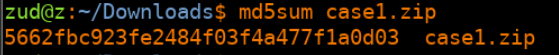
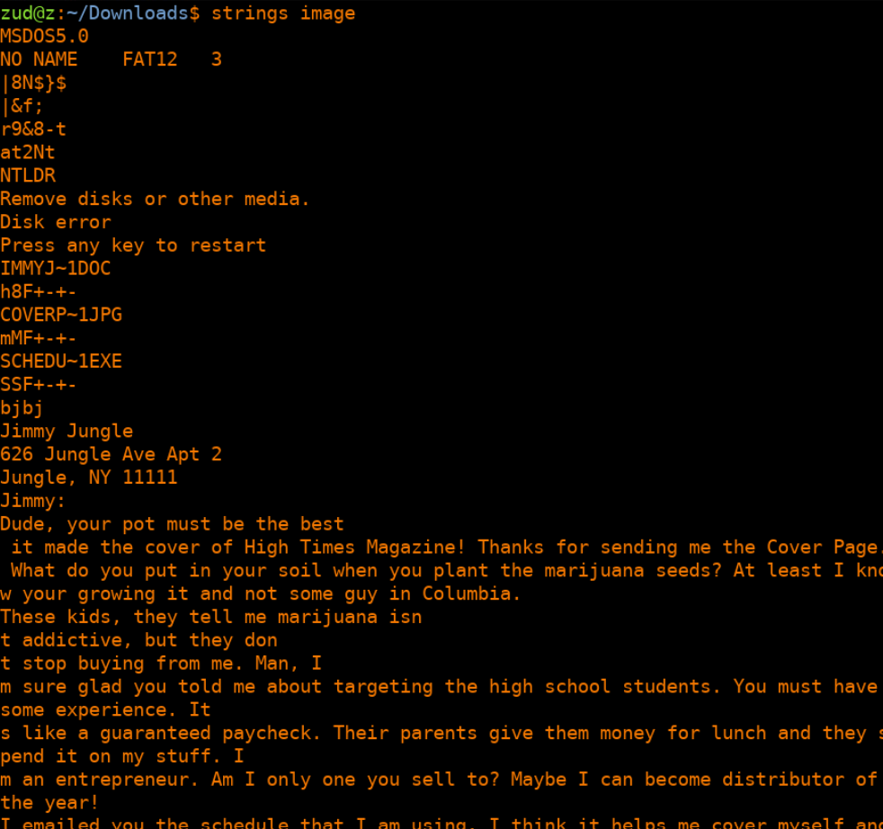
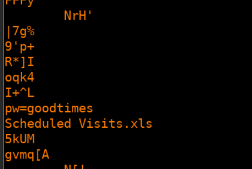
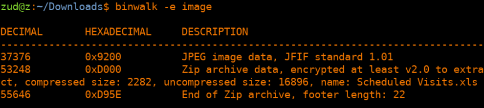
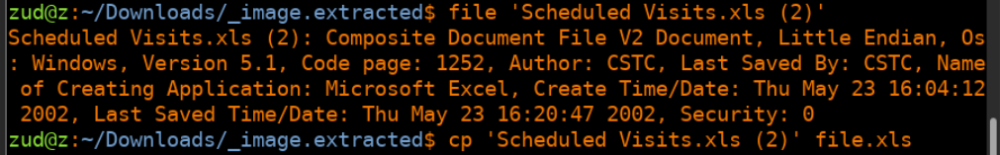
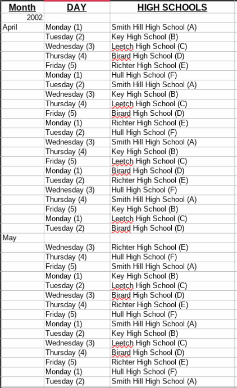
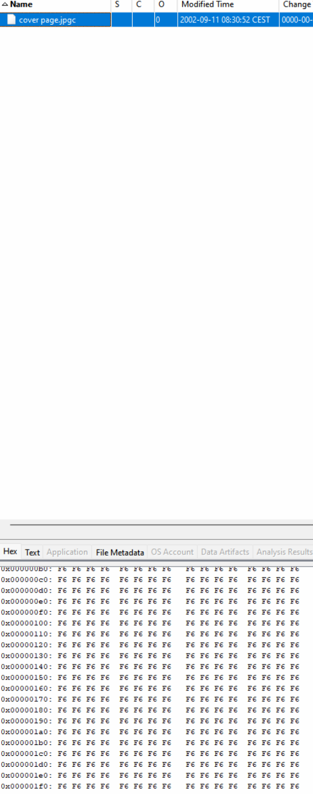
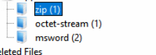

# Reporte de caso 0

Juan Diego Llano Miraval

Fecha: 16/05/2024

## procedure

As a first step we checked the integrity of the file by getting the MD5:




I ran strings into the image of the floppy disk and i was able to extract a message from the dealer to the provider:

```
Jimmy Jungle
626 Jungle Ave Apt 2
Jungle, NY 11111
Jimmy:
Dude, your pot must be the best 
 it made the cover of High Times Magazine! Thanks for sending me the Cover Page. What do you put in your soil when you plant the marijuana seeds? At least I know your growing it and not some guy in Columbia.
These kids, they tell me marijuana isn
t addictive, but they don
t stop buying from me. Man, I
m sure glad you told me about targeting the high school students. You must have some experience. It
s like a guaranteed paycheck. Their parents give them money for lunch and they spend it on my stuff. I
m an entrepreneur. Am I only one you sell to? Maybe I can become distributor of the year!
I emailed you the schedule that I am using. I think it helps me cover myself and not be predictive.  Tell me what you think. To open it, use the same password that you sent me before with that file. Talk to you later.
Thanks,
Joe 
```



we also were able to extract the password of the mentioned schedule:



from here we run binwalk to extract the files:



we were able to unzip the zip file with the password found on the step before. To the extracted file we checked the type of file it is and changed the name to be properly opend:



when we opened the file we got:





## **Questions:**

1. Who is Joe Jacob's supplier of marijuana and what is the address listed for the supplier?

R. 626 Jungle Ave Apt 2

2. What crucial data is available within the coverpage.jpg file and why is this data crucial?

R. On the analysis I did, there was no jpg file on the binwalk extraction, in autopsy I saw it but there was no information:



autopsy detected the zip and 2 document files:



when I added the image as unallocated Space image, i can see the image, but no crucial information inside.

3. What (if any) other high schools besides Smith Hill does Joe Jacobs frequent?

R. They are in the schedule extracted: Key High School, Leetch High School, Birard High School, Richter High School and Hull High School.

4. For each file, what processes were taken by the suspect to mask them from others?

R. for the document, he delete it, the zip file, the extension was changed to .exe and it had a password. for the jpg file, the extension was also changed to jpgc. 

5. What processes did you (the investigator) use to successfully examine the entire
contents of each file?

R. the process is explained before in the document, first we analyzed the content of the image with autopsy, first allocating the image as disk and later as unallocated space image, and the strings in it. We were able to find the documents, the zip and the existence of the schedule because of that. In the Unallocated part of the memory was the password, that we could also retrieve with strings. Then I used binwalk to extract the zipfile in it, and extract the xls file, I checked that it was an excel file, and adjust the extension before opening it.